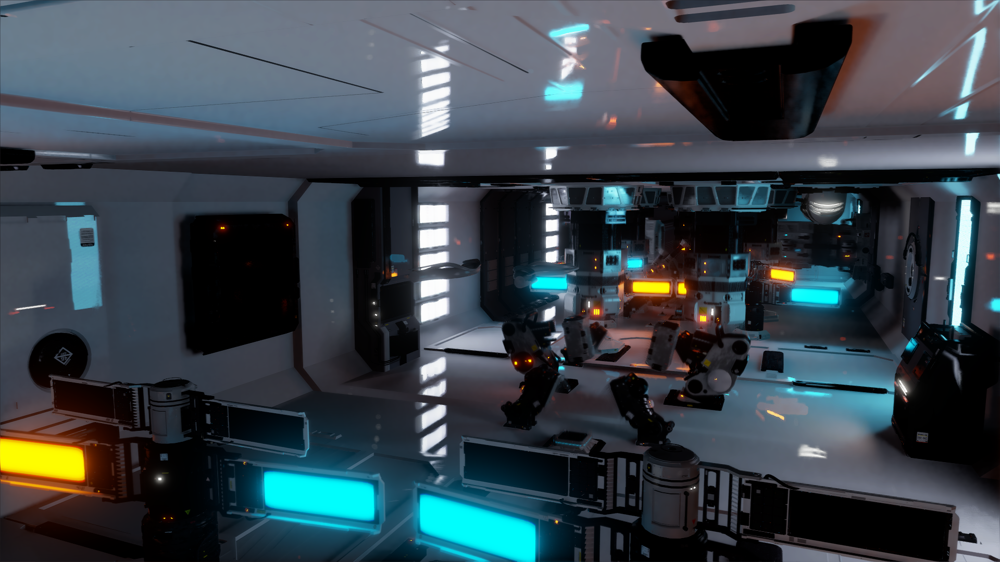
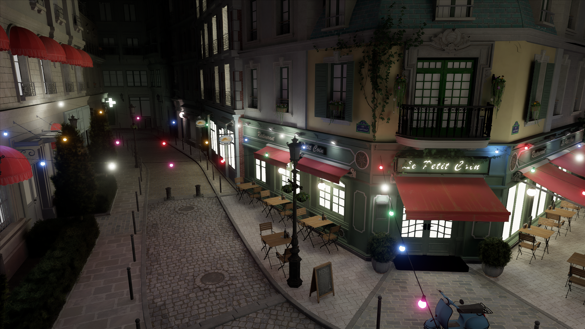

# Real-Time Stochastic Lightcuts I3D 2020 Demo

### Daqi Lin

This demo is for the PACMCGIT (I3D 2020) paper Real-Time Stochastic Lightcuts (Lin & Yuksel, 2020). The project page
of the paper can be found at 
<https://dqlin.xyz/pubs/2020-i3d-SLC/>.

An additional feature in the demo is ray traced glossy reflection, which is produced by sampling the glossy BSDF, intersecting rays with emissive objects, and denoising the result by SVGF [Schied et al. 2017]. Motion vectors of imaginary positions of reflected objects are used for temporal reprojection.

Note that the two large demo scenes, Zero Day and Amazon Lumberyard Bistro, are stored in the Bitbucket repository [RealTimeStochasticLightcuts_LargeModels](https://bitbucket.org/daqi_lin/realtimestochasticlightcuts_largefiles) submodule.
If you want to test those two scenes, you need to use the recursive clone (git clone --recursive https://github.com/DQLin/RealTimeStochasticLightcuts/) or fetch the submodule by running "git submodule update --init --recursive" if you already cloned the repository without the submodule.

This demo is built upon [MiniEngine](https://github.com/microsoft/DirectX-Graphics-Samples/tree/master/MiniEngine) by Team Minigraph at Microsoft.

## Screenshots from the demo

The Beeple Zero-Day Measure Seven scene

The Remastered Amazon Lumberyard Bistro scene

## System Requirements
* Windows 10 build 18362 or above
* Visual Studio 2019 (for compilation) with Windows 10 SDK version >= 18362
* DXR compatible graphics card, NVIDIA GeForce RTX 2060 or higher is recommended
* NVIDIA GeForce Game Ready driver version 446.14 is highly recommended to get the best performance, for unknown reasons newer driver versions (451.48 and 451.67) cause the frame rate to slow down by up to 40%.

 or above (performance may vary with the driver version)

## Libraries Used
* ZLib
* WinPixEventRuntime
* Assimp 3.3
* FreeImage 3
* TinyXml
* GLM
* mikktspace

If the prebuilt binaries do not work with your computer, you should easily find them online.

## Run the demo:
* To run the demo, enter RealTimeStochasticLightcuts/ and open RealTimeStochasticLightcuts.exe (loads the default Zero Day (measure seven) scene)
* In command lines, run "RealTimeStochasticLightcuts.exe \<YourSceneDecsription\>.xml" to load a custom model.

## Build the demo:
* Open RealTimeStochasticLightcuts/RealTimeStochasticLightcuts.sln in Visual Studio 2019
* Choose configuration: Debug or Release
* Build the solution (x64 platform is assumed)

## Controls
* forward/backward/strafe: WASD (FPS controls)
* up/down: E/Q
* yaw/pitch: mouse
* toggle slow movement: lshift
* open/close demo settings menu: backspace
* show/hide frame rate: =
* navigate debug menu: use up/down arrow keys to go through menu items, use left/right to fold/unfold submenus
* toggle debug menu item (boolean type, the toggled state looks like [X]): return
* adjust debug menu value (numeric or enum type): left/right arrow keys
* Navigate to "Save Settings" and press enter to save current settings to a file called "SavedSettings.txt"
* Navigate to "Load Settings" and press enter to load settings from "SavedSettings.txt", assuming it exists
* Navigate to "Display Profiler" and press enter to open the profiler menu. Use numpad 5123 as WASD to navigate
* Press ESC to exit the demo

## Keyboard Shortcuts
* T: toggle TAA
* F: toggle filtering of light sampling results
* B: toggle bloom filter
* R: toggle ray traced (glossy) reflection

## Scene Description
The scene used by the demo can be specified by an XML file. 
All XML files must include a "scenedescription" tag and everything else needs to be defined as children of the tag.

The "scenedescription" tag has a "type" attribute which specifies whether the scene is a VPL scene or a mesh light scene.
In a VPL scene, all meshes are simply light receivers of a directional sunlight (configured with "light" tag, see SceneDescription_sponza.xml for an example), which bounces through the scene and creates VPLs for global illumination. In a mesh light scene, the meshes with emissive material are treated as mesh lights, and only direct illumination is computed. 

The camera parameters are specified by the "camera" tag. Apart from camera position, forward vector, up vector, field of view, frame width and height, near plane, far plane, exposure, translation speed, and rotation speed, setting an animation path for cameras is also supported (by adding keyframes under the "path" tag; see SceneDescription_sponza.xml for an example). Note that some file types like FBX can also contain camera animation, which will override the animation specified in the XML file. In both cases, "animate" tag under "camera" must set its value to "true". 

A model file must be provided through the "path" attribute of the "model" tag. Since Assimp 3.3 is used as the model importer, it should be able to accept all file type that Assimp 3.3 supports. However, we have only tested OBJ files and FBX files. And other file types are not guaranteed to work. If the model contains mesh animations, the program will automatically animate the meshes and update the light trees. Besides, it is possible to specify simple mesh animations in the XML file using "animation" tag (see SceneDescription_cornell.xml for an example). 

## Demo Scenes

Five scenes are included with the demo. The FBX version of BEEPLE Zero-Day released by NVIDIA Open Research Content Archive (ORCA) ("SceneDescription_zeroday.xml"), The exterior part of Amazon Lumberyard Bistro also from OCRA (ported to OBJ by [Morgan McGuire](https://casual-effects.com/data/)) ("SceneDescription_bistro.xml"), the "Arnold buildilng" scene exported from a mesh light scene in Arnold renderer Maya tutorial ("SceneDescription_arnoldbuildings.xml"), the default Crytek Sponza scene in the MinigEnigine ("SceneDescription_sponza.xml"), and the modified Cornell Box scene with Blender sample models inside ("SceneDescription_cornell.xml").

## Demo Settings

#### Animate Camera
_Toggle camera animation (if it exists)._

#### Debug View
_Iterate through 5 different debug views._

#### Display Frame Rate
_Display the frame time and light sampling time._
    
#### Display Profiler
_Display the profiler with CPU/GPU time breakdown._
    
#### Filtering 
_Options for filtering._

Enable
    : Toggle filtering

SVGF
    : Parameters for the SVGF filtering
 * CPhi
    : Lower value causes the bilateral filter more sensitive to color difference
 * NPhi
    : Lower value causes the bilateral filter more sensitive to normal difference
 * ZPhi
    : Lower value causes the bilateral filter more sensitive to depth difference
 * alpha
    : Sets the blending factor for color history. Lower value assigns larger weights to history.
 * max history length
    : The maximium temporal history length (frames) allowed
 * moment alpha
    : Sets the blending factor for moment history. Lower value assigns larger weights to history.
   
#### Sunlight
_Sets parameters for sunlight (only enabled in VPL scenes)._

Sun Shadow Center [X|Y|Z]
   : Sets the center location on far bounding plane of the shadowed region for the directional light frustum

Sun Shadow Dim [X|Y|Z]
   : Sets the bounds for the orthographic projection for the directional light shadow map

#### Rendering
_General rendering options._

Sampling Method
   : Chooses from LightCut (sample from cut nodes), Light Tree (always sample from root node, not using cuts), and Random (uniform random sampling of lights)

Ray Traced Reflection
   : Toggles ray traced (glossy) reflection

Shadow Offset
   : Sets the offset distance of shadow ray to prevent self intersection. For a value x, the shadow ray origin p is changed to p + x * N, where N is the geometric normal. The same offset applys to the shadow ray end points on emissive triangles.  

#### Stochastic Lightcuts
_Settings for stochastic lightcuts._

* Cut Sharing
   : Toggle cut sharing within pixel blocks
      
* Cutsharing Blocksize
   : Sets the cut sharing pixel block size (N for NxN block, N from 1 to 64)   

* Interleave Rate
   : Sets the pixel block size for interleave sampling

* Max Light Samples
   : Sets the maximum number light samples per frame per pixel. For stochastic lightcuts, it is the maximum size of the cut.

* Min Node Error Bound
   : Limits the minimum squared distance (d^2) to a node bounding box in node error bound estimation
     For a value x, d^2 is limited to be no less than x * light_bound_radius (diagonal length of the boundinng box of all lights)
     
* One Level Tree
   : Toggle one/two-level light tree (see last paragraph of section 3.1 in the paper)
     
#### VPL
_Sets parameters that controls VPL generation._

* Density
   : VPL density, a value from 0.1-40.0. 0.1 corresponds to 64 VPLs, and 40.0 corresponds to about 10.5 million VPLs in the demo scene.
   Default is 3.9, which generates about 100000 VPLs.   
   Depending on your scene and ray depth, more than 11 million VPLs generated might cause the program to crash.
   
* Max Ray Depth
   : Light ray depth for random walk generation of VPLs (default: 3), a value from 1 to 10. Notice that this demo only considers 
   diffuse bounces.
   
* Preset Density Level
   : 5 preset density levels are available. These density levels corresponds to about 1k, 10k, 100k, 1M, and 10M VPLs generated in the demo scene.

#### Visualization
_Visualize node bounding boxes in light trees._

Enable Node Viz
    : Toggle tree node visualization

SLC Viz Level
    : 0 -- visualize all levels, 1 -- visualize level 0 (root level), 2 -- visualize level 1, and so on.
    
SLC Viz Mode
    : Sets Viz Mode for two-level trees, All -- visualize both TLAS and BLAS, TLAS -- only visualize TLAS, BLAS -- only visualize BLAS
    
           
#### Post Effects
_The original MiniEngine post effect settings. Including toggling FXAA and TAA, Bloom filter, depth of field, HDR, motion blur._

#### Timing

_VSync and frame rate limiting options._

## Additional notes

* uncomment CPU_BUILDER macro in LightTreeMacros.hlsl and recompile to use CPU (unbalanced) light tree builders
* uncomment GROUND_TRUTH macro in LightTreeMacros.hlsl and recompile to allow accumulating frames to render reference images
* uncomment EXPLORE_DISTANCE_TYPE macro in LightTreeMacros.hlsl to test different types of distance bounds for computing node weights using the "Stochastic Lightcuts->Distance Type" demo setting. Three types distance bounds: Center (distance to center of node bounding box), Yuksel19 (distance bound in the HPG 2019 Stochastic Lightcuts paper by Yuksel), and MinMax (our method) are provided for comparison.

For questions, please email daqi@cs.utah.edu or post an issue here.
